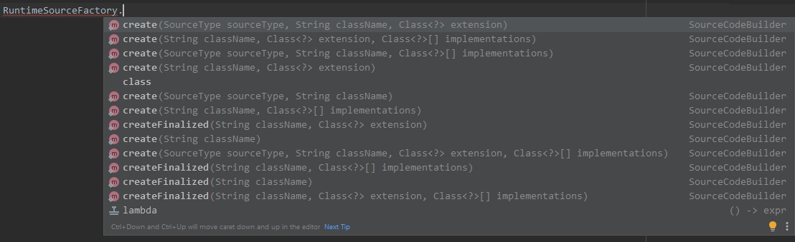
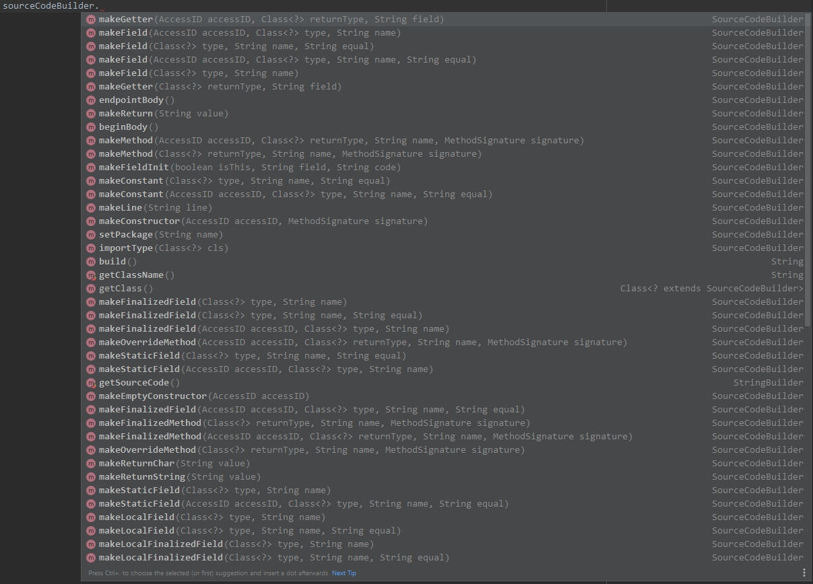

# JRuntimeSource
Use own runtime classes and objects created by this library

---

## FEEDBACK

- My Discord Server: **[Link](https://discord.gg/GmT9pUy8af)**
- My VKontakte Page: **[Link](https://vk.com/itzstonlex)**

---

## HOW TO USE?

To begin with, we need to understand how to generally<br> 
build a hierarchy and structure of our classes.

For this, `com.itzstonlex.runtimesource.SourceCodeBuilder` will help us

Usage example:
```java
SourceCodeBuilder sourceCodeBuilder = RuntimeSourceFactory.create("User", null, new Class[]{Serializable.class})
        .setPackage("com.itzstonlex.users")

        .makeFinalizedField(AccessID.PRIVATE, String.class, "name")
        .makeConstructor(AccessID.PUBLIC, MethodSignature.with(
                MethodParam.create(String.class, "name")
        ))
        .beginBody()
            .makeFieldInit(true, "name", "name")
        .endpointBody()

        .makeGetter(String.class, "name")

        .makeOverrideMethod(AccessID.PUBLIC, String.class, "toString", MethodSignature.empty())
        .beginBody()
            .makeReturn("getName()")
        .endpointBody();
```


Thus, we have created a sample of our class.

Initial view so far:

```java
package com.itzstonlex.users;

import java.io.Serializable;

public class User implements Serializable {

    private final String name;

    public User(String name) {
        this.name = name;
    }

    public String getName() {
        return name;
    }

    @Override
    public String toString() {
        return getName();
    }
}
```

---

Our next step is to directly compile this class and save it to Runtime:

```java
RuntimeCompiler runtimeCompiler = new RuntimeCompiler();
runtimeCompiler.addClass(sourceCodeBuilder);

runtimeCompiler.compile();
```

Since displaying the `Object` on the screen calls the `toString()`<br>
method from it, we will end up with the username entered through<br>
reflection:

```java
Class<?> compiledClass = runtimeCompiler.getCompiledClass("com.itzstonlex.users.User");

System.out.println(compiledClass.getConstructor(String.class).newInstance("itzstonlex"));
// output: itzstonlex
```

---

### References:




---

## PLEASE, SUPPORT ME


By clicking on this link, you can support me as a 
developer and motivate me to develop new open-source projects!

<a href="https://www.buymeacoffee.com/itzstonlex" target="_blank"></a>
